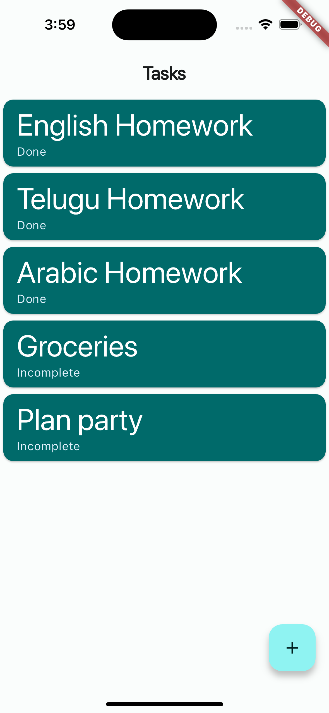

# flutter_application_proto_ii

Task Tracker Full Stack

Task Tracker Full Stack is a simple full-stack application that allows users to manage tasks. The application is built with Flutter (Dart) for the frontend and Ktor (Kotlin) for the backend. MongoDB is used as the database to store task data.

Features:
The project features a comprehensive set of task management functionalities, allowing users to effortlessly create, view, update, and delete tasks. 
The user experience is enhanced through an intuitive mobile interface designed for efficient task management. 
Task details are conveniently presented in a scrollable list, providing users with a clear overview. 
Additionally, a dedicated screen is implemented to streamline the task-editing process, contributing to a user-friendly and efficient project workflow.

Tech Stack
•	Frontend:
o	Flutter (Dart)
•	Backend:
o	Ktor (Kotlin)
o	MongoDB

Getting Started

Prerequisites
•	Make sure you have Flutter, Ktor, and MongoDB installed on your machine.
Running Locally
1.	Clone the repository:
bashCopy code
git clone [https://github.com/your-username/task-tracker-full-stack.git](https://github.com/shoebsmk/TaskTrackerFullstack.git) cd task-tracker-full-stack

3.	Run Backend (Ktor):
git clone https://github.com/shoebsmk/com.example.ktor-bknd.git
bashCopy code
cd backend ./gradlew run

5.	Run Frontend (Flutter):
bashCopy code
cd frontend flutter run

7.	Open the App:
Open the Task Tracker app on your emulator or physical device.
API Endpoints

•	GET All Tasks:
API URL: http://0.0.0.0:8080/get-all-tasks

o	Method: GET
Description: Retrieve a list of all tasks.

•	Create Task:
API URL: http://0.0.0.0:8080/create-update-task

o	Method: POST
Description: Create a new task. (Request Body: JSON with task details)

•	Get Task by ID:
API URL: http://0.0.0.0:8080/get-task

o	Method: GET
Description: Retrieve details of a specific task by its ID.

•	Update Task:
API URL: http://0.0.0.0:8080/create-update-task

o	Method: PUT
Description: Update an existing task by providing updated task details in the request body. (Request Body: JSON with updated task details)

•	Delete Task:
API URL: http://0.0.0.0:8080/delete-task

o	Method: DELETE
Description: Delete a task by its ID.

Architecture Overview

The application follows a client-server architecture. The Flutter frontend communicates with the Ktor backend through RESTful API endpoints. MongoDB is used to persistently store task data.

Additional Information

•	The project structure is organized into separate folders for the frontend and backend.

•	Frontend code is located in the frontend repo, and backend code is in the backend repo.
Notes

•	This project was developed as part of a hiring round.

Screenshots:

